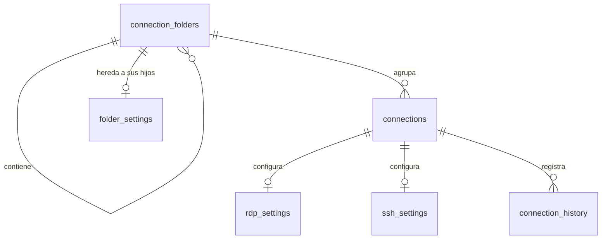
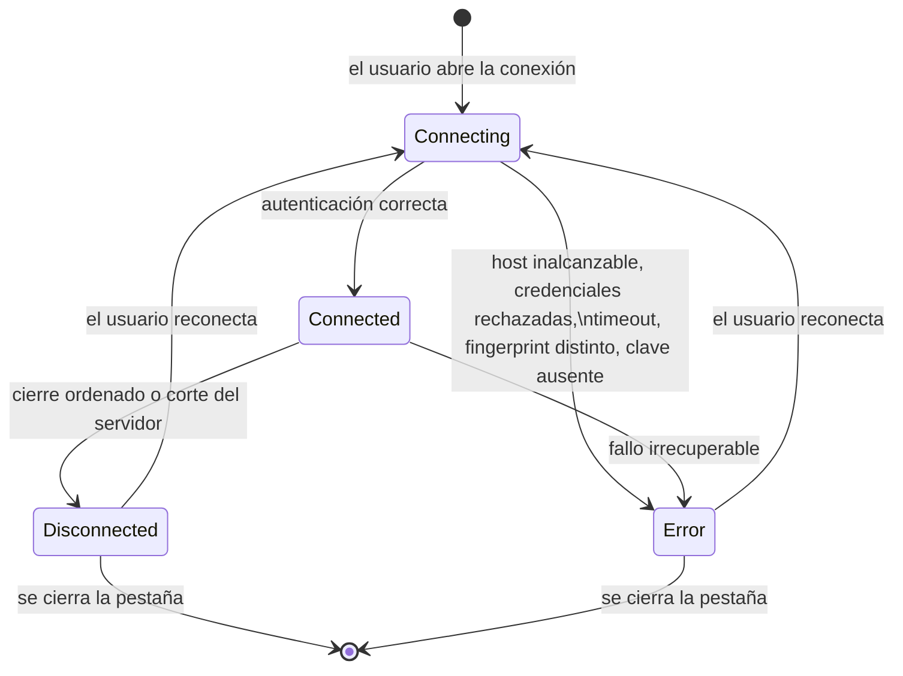

# Modelo de datos: CafManagerConection (CMC)

**Feature**: `001-rdp-ssh-server-manager` · **Fecha**: 2026-08-24 · **Fase**: 1

> **Estado del esquema**: este documento **propone** el esquema. Conforme al Principio de la
> puerta de esquema de la constitución, la migración inicial no se escribe como archivo
> ejecutable ni se aplica hasta que el usuario confirme explícitamente este diseño.

## Panorama



Reglas transversales:

- Toda marca temporal se almacena en **UTC**, en texto ISO-8601 (`YYYY-MM-DDTHH:MM:SS.fffZ`),
  y se presenta en hora local.
- Los identificadores son `TEXT` con un GUID en formato canónico. Se eligen sobre enteros
  autoincrementales porque la `CredentialKey` los incorpora y deben ser estables e
  irrepetibles aunque se borre y recree una conexión.
- Los booleanos se almacenan como `INTEGER` con valores 0 y 1.
- `PRAGMA foreign_keys = ON` se aplica en cada conexión abierta; sin eso, el borrado en
  cascada de carpetas y configuraciones no ocurre.
- **`NULL` significa "heredar"** en todo campo heredable. Es la regla que sostiene toda la
  cascada de FR-058 a FR-064 y conviene tenerla presente al leer las tablas de abajo.

## Modelo de herencia

Una carpeta puede definir credencial y configuración que sus descendientes heredan. El valor
efectivo de un campo se resuelve recorriendo el árbol hacia arriba y tomando el primero que
no sea `NULL`:

```text
conexión → carpeta contenedora → carpeta padre → … → raíz → (sin valor)
```

**El almacenamiento no distingue "heredado" de "no definido": ambos son `NULL`.** La casilla
"heredar" que exige FR-059 es un elemento de interfaz: marcarla escribe `NULL`, desmarcarla
escribe el valor que el usuario cargue. Esa separación es deliberada — evita agregar una
columna de bandera por cada campo heredable, que duplicaría el ancho de las tablas sin
aportar información que el `NULL` no dé ya.

**Los valores heredados nunca se copian a la conexión.** Se calculan al usarlos. Por eso
cambiar la credencial de una carpeta con veinte conexiones actualiza las veinte sin tocarlas
(SC-013), y por eso mover una conexión cambia lo que hereda (FR-062).

**Campos heredables**: `username`, `domain`, `port`, `credential_key`, y todos los ajustes
específicos de protocolo. **No heredables**: `name`, `host`, `protocol`, `notes` y todo lo
que identifica a una conexión en particular.

---

## Entidades del dominio

Los tipos de `CafManagerConection.Domain` no conocen SQLite ni Dapper (Principio I). El mapeo
a tablas vive en `CafManagerConection.Infrastructure`.

### Folder (carpeta)

| Campo | Tipo | Reglas |
| --- | --- | --- |
| `Id` | GUID | obligatorio, inmutable |
| `ParentId` | GUID? | nulo en la raíz; no puede ser el propio `Id` ni un descendiente |
| `Name` | texto | obligatorio, 1 a 100 caracteres, sin espacios al inicio o al final |
| `SortOrder` | entero | orden dentro de su carpeta padre |
| `CreatedAt` | instante | obligatorio |
| `UpdatedAt` | instante | obligatorio |

**Validaciones**: mover una carpeta dentro de sí misma o de uno de sus descendientes crea un
ciclo y se rechaza (FR-001). Dos carpetas hermanas pueden llamarse igual: se advierte, no se
impide, por coherencia con FR-053.

### FolderSettings (configuración heredable de una carpeta)

Fila opcional, como máximo una por carpeta. Todos sus campos son anulables: un `NULL` acá
significa que esta carpeta no define ese valor y la resolución sigue subiendo.

| Campo | Tipo | Reglas |
| --- | --- | --- |
| `FolderId` | GUID | clave primaria y foránea |
| `Username` | texto? | usuario heredable |
| `Domain` | texto? | dominio heredable (RDP) |
| `Port` | entero? | 1 a 65535 |
| `RdpCredentialKey` | texto? | formato `cmc:folder:<FolderId>:rdp` (FR-064) |
| `WebCredentialKey` | texto? | formato `cmc:folder:<FolderId>:web` (FR-120) |
| `SshCredentialKey` | texto? | formato `cmc:folder:<FolderId>:ssh` (FR-064) |
| `RdpClipboardEnabled` | booleano? | |
| `RdpFitToTab` | booleano? | |
| `RdpIgnoreCertificateWarnings` | booleano? | |
| `SshAuthMethod` | enumeración? | `Password` o `PrivateKey` |
| `SshPrivateKeyPath` | texto? | ruta, nunca contenido |
| `SshKeepAliveSeconds` | entero? | 0 a 3600 |

**Una sola tabla para ambos protocolos, y no dos**: una carpeta puede contener conexiones RDP
y SSH mezcladas, así que necesita poder definir ajustes de los dos. Separarlas en
`folder_rdp_settings` y `folder_ssh_settings` obligaría a consultar dos tablas por cada
escalón de la cascada, sin ganar nada: los campos son pocos y todos anulables.

**El fingerprint del host SSH no es heredable**: es propio de cada host y compartirlo entre
conexiones anularía el sentido de la verificación de FR-023.

**Dos columnas de credencial y no una** (FR-064a): una carpeta puede contener conexiones RDP
y SSH mezcladas —agrupar por entorno, con los Windows y los Linux de "Producción" juntos, es
justamente cómo se organiza un parque—. Cada conexión hereda la credencial de su protocolo.
Una sola columna obligaría a que el usuario y la contraseña del Windows de dominio fueran los
mismos que los del servidor Linux, que casi nunca es el caso.

### Connection (conexión)

| Campo | Tipo | Reglas |
| --- | --- | --- |
| `Id` | GUID | obligatorio, inmutable; forma parte de la `CredentialKey` |
| `FolderId` | GUID? | nulo si la conexión cuelga de la raíz |
| `Name` | texto | obligatorio, 1 a 100 caracteres |
| `Protocol` | enumeración | `Rdp`, `Ssh` o `Web`; **inmutable** una vez creada |
| `Host` | texto | obligatorio; nombre de host o dirección IPv4/IPv6 válida |
| `Port` | entero? | 1 a 65535. `NULL` hereda; si nadie lo define, se usa 3389 (RDP) o 22 (SSH) |
| `Username` | texto? | `NULL` hereda; si nadie lo define, se pide al conectar |
| `CredentialKey` | texto? | referencia opaca; **nunca** contiene el secreto. `NULL` hereda |
| `Notes` | texto? | libre, hasta 4000 caracteres |
| `CreatedAt` | instante | obligatorio |
| `UpdatedAt` | instante | obligatorio |
| `LastConnectedAt` | instante? | nulo hasta la primera conexión exitosa |
| `SortOrder` | entero | orden dentro de su carpeta |

**Validaciones**:

- `Protocol` es inmutable: cambiar el protocolo de una conexión existente invalidaría su
  configuración específica y su credencial. La operación equivalente es duplicar y crear.
- `CredentialKey` sigue el formato `cmc:<rdp|ssh>:<Id>`. El identificador y no el nombre,
  para que renombrar no huérfane la credencial.
- Un nombre repetido dentro de la misma carpeta **se advierte pero se permite** (FR-053).

### RdpSettings (configuración RDP)

Existe exactamente una fila por conexión cuyo protocolo es `Rdp`.

| Campo | Tipo | Predeterminado | Reglas |
| --- | --- | --- | --- |
| `ConnectionId` | GUID | — | clave primaria y foránea |
| `Domain` | texto? | hereda | dominio de Windows, opcional |
| `ClipboardEnabled` | booleano? | hereda → `true` | FR-014 |
| `FitToTab` | booleano? | hereda → `true` | ajustar la resolución al tamaño de la pestaña (FR-015) |
| `IgnoreCertificateWarnings` | booleano? | hereda → `false` | validar es el predeterminado (FR-016) |
| `StartFullScreen` | booleano | `false` | abrir directamente a pantalla completa; **no heredable** |

En la columna de predeterminados, "hereda → X" significa que `NULL` dispara la cascada y que
X es el valor final si ninguna carpeta ascendente lo define.

**Nota de diseño**: las redirecciones prohibidas por FR-017 (discos, audio, micrófono,
impresoras, puertos, cámaras, tarjetas inteligentes, RemoteApp, Gateway) **no se modelan como
campos**. No son configurables: se fijan apagadas en el adaptador RDP. Modelarlas como
columnas invitaría a encenderlas y contradiría el Principio V.

### SshSettings (configuración SSH)

Existe exactamente una fila por conexión cuyo protocolo es `Ssh`.

| Campo | Tipo | Predeterminado | Reglas |
| --- | --- | --- | --- |
| `ConnectionId` | GUID | — | clave primaria y foránea |
| `AuthMethod` | enumeración? | hereda → `Password` | `Password` o `PrivateKey` |
| `PrivateKeyPath` | texto? | hereda | obligatorio cuando el `AuthMethod` efectivo es `PrivateKey`; ruta, **nunca** contenido |
| `KnownHostFingerprint` | texto? | nulo | formato `SHA256:<base64>`; nulo hasta la primera aceptación. **No heredable** |
| `KeepAliveSeconds` | entero? | hereda → 60 | 0 desactiva el keep-alive; máximo 3600 |
| `Encoding` | texto | `UTF-8` | FR-025; no heredable |

**Validaciones**: si `AuthMethod` es `PrivateKey`, `PrivateKeyPath` es obligatorio. Que el
archivo exista se comprueba al conectar, no al guardar: la clave puede estar en una unidad
que no está montada en ese momento.

### ConnectionHistoryEntry (evento de historial)

| Campo | Tipo | Reglas |
| --- | --- | --- |
| `Id` | GUID | obligatorio |
| `ConnectionId` | GUID | foránea; se borra en cascada con la conexión |
| `AttemptedAt` | instante | obligatorio |
| `Outcome` | enumeración | `Success`, `Failed`, `Cancelled` |
| `FailureReason` | enumeración? | ver más abajo; nulo cuando `Outcome` es `Success` |
| `DurationSeconds` | entero? | duración de la sesión; nulo si nunca conectó |

`FailureReason` es un valor cerrado, no un texto libre: `HostUnreachable`,
`AuthenticationRejected`, `Timeout`, `HostKeyMismatch`, `PrivateKeyNotFound`,
`BadPassphrase`, `CredentialMissing`, `UnexpectedDisconnect`, `Other`. Un enumerado y no el
mensaje del servidor, porque el mensaje puede contener datos de la sesión y porque FR-051
exige distinguir las causas de forma programática.

**Retención**: se conservan los últimos 100 eventos por conexión; al insertar el evento 101
se elimina el más antiguo (supuesto documentado en la especificación).

### ApplicationSettings (preferencias)

Almacén de pares clave-valor con una sola fila por clave. Claves previstas:

| Clave | Tipo del valor | Predeterminado |
| --- | --- | --- |
| `window.width` / `window.height` | entero | 1280 / 800 |
| `window.x` / `window.y` | entero | centrado |
| `window.maximized` | booleano | `false` |
| `theme` | `Light` / `Dark` / `System` | `System` |
| `terminal.scrollbackLines` | entero | 10000 |
| `terminal.fontFamily` | texto | `Cascadia Mono` |
| `terminal.fontSize` | entero | 10 |
| `connection.timeoutSeconds` | entero | 30 |

Clave-valor y no columnas fijas porque el conjunto de preferencias va a crecer y no amerita
una migración por cada una. Al restaurar la geometría se verifica que la ventana quede
dentro de un monitor conectado; si no, se centra en el principal.

---

### SshTunnel (túnel)

| Campo | Tipo | Reglas |
| --- | --- | --- |
| `Id` | GUID | obligatorio |
| `ConnectionId` | GUID | foránea; se borra en cascada con la conexión |
| `Name` | texto | descriptivo, 1 a 100 caracteres |
| `LocalPort` | entero | 1 a 65535 |
| `RemoteHost` | texto | destino visto **desde el servidor**, habitualmente `localhost` |
| `RemotePort` | entero | 1 a 65535 |
| `AutoStart` | booleano | levantar al conectar la sesión (FR-091) |
| `SortOrder` | entero | orden de presentación |

**No es heredable**: un túnel mapea un puerto local concreto, y dos conexiones que heredaran
el mismo túnel chocarían entre sí al levantarlo. El estado activo/inactivo tampoco se
persiste: vive con la sesión.

## Objetos que **no** se persisten

- **Session (sesión)**: vive solo en memoria mientras la pestaña existe. Tiene
  `ConnectionId`, `State` (`Connecting`, `Connected`, `Disconnected`, `Error`), `StartedAt` y
  `FailureReason`. No se persiste porque las sesiones no se restauran al reabrir la
  aplicación (supuesto documentado).
- **Métricas del servidor** (`ServerSnapshot`, `CpuMetrics`, `MemoryMetrics`,
  `NetworkMetrics`, `DiskMetrics`): viven sólo en memoria mientras el panel de estado está
  abierto, con los últimos 60 puntos por métrica. **Nunca se escriben en SQLite** (FR-085):
  persistirlas convertiría a CMC en un sistema de monitoreo, que es explícitamente lo que no
  es.
- **Inventario de plataforma** (contenedores, servicios de compose, sitios de nginx, procesos
  de supervisord): se lee del servidor en cada consulta y no se almacena. Guardarlo daría una
  foto vieja de un estado que cambia solo.
- **Capacidades del servidor** (si es Linux, si tiene Docker, nginx o supervisord): se
  detectan una vez por sesión y se mantienen en memoria mientras dura.
- **Estado de un túnel** (activo o detenido): vive con la sesión; sólo se persiste su
  definición.
- **Credential (credencial)**: nunca toca SQLite. Vive en Windows Credential Manager y en
  memoria el menor tiempo posible (Principio II).

### Transiciones de estado de una sesión



Ninguna transición ocurre sola: `Error` y `Disconnected` no reintentan por su cuenta
(supuesto documentado, para no bloquear cuentas por reintentos repetidos).

---

## Esquema SQLite propuesto

`user_version = 1`. Migración inicial, en uso.

> **`user_version = 2`** agrega el color del icono y las conexiones hijas. Ver
> [Migración 2](#migración-2--color-de-icono-y-conexiones-hijas) al final de esta sección.

```sql
CREATE TABLE connection_folders (
    id          TEXT PRIMARY KEY NOT NULL,
    parent_id   TEXT NULL REFERENCES connection_folders(id) ON DELETE CASCADE,
    name        TEXT NOT NULL,
    sort_order  INTEGER NOT NULL DEFAULT 0,
    created_at  TEXT NOT NULL,
    updated_at  TEXT NOT NULL
);
CREATE INDEX ix_folders_parent ON connection_folders(parent_id, sort_order);

-- Configuración que la carpeta hereda a sus descendientes (FR-058 a FR-064).
-- Todo NULL significa "esta carpeta no define este valor": la resolución sigue subiendo.
CREATE TABLE folder_settings (
    folder_id                        TEXT PRIMARY KEY NOT NULL
                                     REFERENCES connection_folders(id) ON DELETE CASCADE,
    username                         TEXT NULL,
    domain                           TEXT NULL,
    port                             INTEGER NULL
                                     CHECK (port IS NULL OR port BETWEEN 1 AND 65535),
    rdp_credential_key               TEXT NULL,
    ssh_credential_key               TEXT NULL,
    web_credential_key               TEXT NULL,
    rdp_clipboard_enabled            INTEGER NULL,
    rdp_fit_to_tab                   INTEGER NULL,
    rdp_ignore_certificate_warnings  INTEGER NULL,
    ssh_auth_method                  TEXT NULL
                                     CHECK (ssh_auth_method IS NULL
                                            OR ssh_auth_method IN ('Password', 'PrivateKey')),
    ssh_private_key_path             TEXT NULL,
    ssh_keep_alive_seconds           INTEGER NULL
                                     CHECK (ssh_keep_alive_seconds IS NULL
                                            OR ssh_keep_alive_seconds BETWEEN 0 AND 3600)
);

CREATE TABLE connections (
    id                TEXT PRIMARY KEY NOT NULL,
    folder_id         TEXT NULL REFERENCES connection_folders(id) ON DELETE CASCADE,
    name              TEXT NOT NULL,
    protocol          TEXT NOT NULL CHECK (protocol IN ('Rdp', 'Ssh', 'Web')),
    host              TEXT NOT NULL,
    port              INTEGER NULL CHECK (port IS NULL OR port BETWEEN 1 AND 65535),
    username          TEXT NULL,
    credential_key    TEXT NULL,
    notes             TEXT NULL,
    created_at        TEXT NOT NULL,
    updated_at        TEXT NOT NULL,
    last_connected_at TEXT NULL,
    sort_order        INTEGER NOT NULL DEFAULT 0
);
CREATE INDEX ix_connections_folder ON connections(folder_id, sort_order);
CREATE INDEX ix_connections_search ON connections(name, host, username);

CREATE TABLE rdp_settings (
    connection_id               TEXT PRIMARY KEY NOT NULL
                                REFERENCES connections(id) ON DELETE CASCADE,
    domain                      TEXT NULL,
    clipboard_enabled           INTEGER NULL,
    fit_to_tab                  INTEGER NULL,
    ignore_certificate_warnings INTEGER NULL,
    start_full_screen           INTEGER NOT NULL DEFAULT 0
);

CREATE TABLE ssh_settings (
    connection_id          TEXT PRIMARY KEY NOT NULL
                           REFERENCES connections(id) ON DELETE CASCADE,
    auth_method            TEXT NULL
                           CHECK (auth_method IS NULL
                                  OR auth_method IN ('Password', 'PrivateKey')),
    private_key_path       TEXT NULL,
    known_host_fingerprint TEXT NULL,
    keep_alive_seconds     INTEGER NULL
                           CHECK (keep_alive_seconds IS NULL
                                  OR keep_alive_seconds BETWEEN 0 AND 3600),
    encoding               TEXT NOT NULL DEFAULT 'UTF-8'
);

-- Túneles de reenvío de puerto local definidos en una conexión SSH (FR-088 a FR-093).
CREATE TABLE ssh_tunnels (
    id            TEXT PRIMARY KEY NOT NULL,
    connection_id TEXT NOT NULL REFERENCES connections(id) ON DELETE CASCADE,
    name          TEXT NOT NULL,
    local_port    INTEGER NOT NULL CHECK (local_port BETWEEN 1 AND 65535),
    remote_host   TEXT NOT NULL,
    remote_port   INTEGER NOT NULL CHECK (remote_port BETWEEN 1 AND 65535),
    auto_start    INTEGER NOT NULL DEFAULT 0,
    sort_order    INTEGER NOT NULL DEFAULT 0
);
CREATE INDEX ix_tunnels_connection ON ssh_tunnels(connection_id, sort_order);

-- Entradas web (FR-114 a FR-120). Una fila por conexion cuyo protocolo es 'Web'.
CREATE TABLE web_settings (
    connection_id  TEXT PRIMARY KEY NOT NULL
                   REFERENCES connections(id) ON DELETE CASCADE,
    url            TEXT NOT NULL,
    browser        TEXT NULL,
    private_window INTEGER NOT NULL DEFAULT 0
);

CREATE TABLE connection_history (
    id               TEXT PRIMARY KEY NOT NULL,
    connection_id    TEXT NOT NULL REFERENCES connections(id) ON DELETE CASCADE,
    attempted_at     TEXT NOT NULL,
    outcome          TEXT NOT NULL CHECK (outcome IN ('Success', 'Failed', 'Cancelled')),
    failure_reason   TEXT NULL,
    duration_seconds INTEGER NULL
);
CREATE INDEX ix_history_connection ON connection_history(connection_id, attempted_at DESC);

CREATE TABLE application_settings (
    key   TEXT PRIMARY KEY NOT NULL,
    value TEXT NOT NULL
);
```

### Migración 2 — color de icono y conexiones hijas

Escrita y aplicada en
`src/CafManagerConection.Infrastructure/Database/Migrations/Migration002_ColorJerarquiaCatalogo.cs`.

Son **dos columnas anulables**. Ninguna toca los datos existentes: todo lo que ya está
cargado queda en `NULL`, que significa exactamente el comportamiento de hoy. Por eso la
migración es puramente aditiva y no necesita reescribir ninguna fila.

```sql
-- user_version = 2

ALTER TABLE connection_folders ADD COLUMN icon_color TEXT NULL;
ALTER TABLE connections        ADD COLUMN icon_color TEXT NULL;

ALTER TABLE connections ADD COLUMN parent_connection_id TEXT NULL
                        REFERENCES connections(id) ON DELETE CASCADE;

CREATE INDEX ix_connections_parent ON connections(parent_connection_id, sort_order);

-- Metadatos de catálogo, pedidos el 2026-08-25 para no volver a migrar por cada campo.
ALTER TABLE connections        ADD COLUMN description       TEXT NULL;
ALTER TABLE connections        ADD COLUMN tags              TEXT NULL;
ALTER TABLE connections        ADD COLUMN documentation_url TEXT NULL;
ALTER TABLE connections        ADD COLUMN is_favorite       INTEGER NOT NULL DEFAULT 0;
ALTER TABLE connections        ADD COLUMN custom_fields     TEXT NULL;

ALTER TABLE connection_folders ADD COLUMN description       TEXT NULL;
ALTER TABLE connection_folders ADD COLUMN tags              TEXT NULL;

-- El entorno se hereda como todo lo demás: NULL en la conexión significa "el de mi carpeta".
ALTER TABLE folder_settings ADD COLUMN environment TEXT NULL;
ALTER TABLE connections     ADD COLUMN environment TEXT NULL;

CREATE INDEX ix_connections_favorite ON connections(is_favorite) WHERE is_favorite = 1;
```

#### Por qué estos campos y no otros

`description` es una línea corta que se muestra en el árbol; `notes` —que **ya existe** desde
la migración 1 y ya se edita en el editor de conexión— es el texto largo. Son cosas distintas
y conviene no mezclarlas: una se lee de un vistazo, la otra se abre a propósito.

`environment` va con la herencia y no suelto porque el caso real es marcar una carpeta entera
como producción. Sirve para lo que importa: que la fila se vea distinta antes de que alguien
tipee algo en el servidor equivocado. Los valores se validan en el dominio y no con un `CHECK`
en la base, para poder agregar uno sin migrar.

`tags` es texto separado por comas, no una tabla de etiquetas. Una tabla sería lo correcto si
hubiera que consultarlas de forma masiva; acá el universo son cientos de conexiones en memoria
y filtrar por subcadena alcanza. Es la opción más simple que funciona (Principio V).

`custom_fields` es JSON, y es **la respuesta real a «no volver a migrar»**: cualquier dato que
aparezca después vive ahí sin tocar el esquema. El costo honesto: no está indexado ni tipado,
así que sirve para mostrar y anotar, **no** para filtrar ni ordenar. Todo campo que vaya a
usarse para buscar tiene que ser una columna de verdad.

#### Lo que deliberadamente no se agrega

No se agregan `owner`, `asset_id`, `mac_address` ni `serial` aunque otras herramientas los
tengan. Sin un uso concreto en la interfaz, una columna vacía es sólo un campo más que llenar
en el editor. Cuando alguno haga falta, entra por `custom_fields` sin migración; si demuestra
que se usa, se promueve a columna.

**`icon_color`** guarda la **clave** del color (`azul`, `ambar`, …), no su valor hexadecimal.
Es a propósito: la misma clave se resuelve a un tono distinto en tema claro y en oscuro, así
que guardar el hexadecimal ataría el ajuste a un tema. Una clave que ya no exista en la
paleta cae en el color por omisión en lugar de romper.

La resolución tiene **dos escalones: color propio del elemento → color global del protocolo**,
y a diferencia del resto de la herencia no pasa por la carpeta (FR-135). Por eso `FolderSettings`
no tiene campo de color y `SettingsResolver`
(`src/CafManagerConection.UseCases/Inheritance/SettingsResolver.cs`) no lo resuelve.

**`parent_connection_id`** permite colgar conexiones de otra conexión. El caso que lo motiva:
un servidor SSH con varios servicios HTTP en puertos distintos —Portainer en 9000, Grafana en
3000— que hoy quedan sueltos al mismo nivel que el servidor y repitiendo su host.

Se modela reusando `connections` y **no** con una tabla nueva de «servicios» porque un
servicio *es* una conexión: se abre, tiene URL, tiene credenciales y hereda. Reusando la
tabla vienen gratis el editor, los iconos, la búsqueda y la herencia. El beneficio que no es
obvio: el hijo hereda el **host** del padre, así que al agregar un servicio sólo se carga el
puerto, y si el servidor cambia de IP se cambia una vez.

**Un solo nivel** (FR-127): una conexión que ya tiene padre no puede ser padre de otra. El
caso real es «servidor y sus servicios», y la profundidad arbitraria complicaría el árbol y el
arrastrar y soltar sin un uso que lo pida.

Esa regla tiene un beneficio que no es obvio: **hace imposible el ciclo por construcción**. Un
ciclo (`A` hijo de `B` y `B` hijo de `A`) necesita al menos dos niveles, y colgaría el
recorrido del árbol. SQLite no lo impide con una clave foránea a sí misma, así que sin el
límite habría que detectarlo recorriendo la cadena antes de cada guardado. Con el límite, la
validación es una sola condición: *si el padre elegido ya tiene padre, se rechaza*.

El `ON DELETE CASCADE` sobre sí misma cubre el borrado: eliminar el servidor elimina sus
servicios, que es lo esperable, previo aviso de cuántos son (FR-128).

### Decisiones del esquema que conviene explicitar

- **`ON DELETE CASCADE` en todas partes**: borrar una carpeta arrastra sus subcarpetas, sus
  conexiones, la configuración de cada una y su historial. Es lo que espera el usuario al
  confirmar el borrado en FR-010, y evita filas huérfanas.
- **La cascada no alcanza a las credenciales**: SQLite no puede borrar del Credential
  Manager. El borrado de una conexión es una operación de la capa de aplicación que borra
  primero la credencial y después la fila (FR-038). Si el borrado de la credencial falla, la
  fila **no** se borra: es preferible una conexión visible a una credencial huérfana e
  invisible.
- **Sin restricción de unicidad sobre `(folder_id, name)`**: es deliberado. FR-053 pide
  advertir, no impedir.
- **`ix_connections_search`**: la búsqueda de FR-007 ignora mayúsculas y acentos, algo que
  SQLite no resuelve por sí solo para caracteres acentuados. Con el volumen esperado
  (decenas o cientos de conexiones) el filtrado se hace en memoria tras cargar el árbol; el
  índice sirve al ordenamiento y a las consultas por nombre exacto.
- **`credential_key` es anulable**: una conexión sin credencial guardada es un estado válido
  y previsto (FR-039), no un error. Desde la incorporación de la herencia, `NULL` además
  significa "usá la credencial que herede de mis carpetas".
- **Los `CHECK` de los campos heredables admiten `NULL`**: escribir
  `CHECK (port BETWEEN 1 AND 65535)` rechazaría el `NULL` que representa la herencia. De ahí
  el `port IS NULL OR …` en cada restricción de un campo heredable.
- **La cascada se resuelve en memoria, no en SQL**: el árbol de carpetas se carga entero al
  arrancar, así que subir por él para encontrar el primer valor no nulo es recorrer una lista
  ya cargada. Una consulta recursiva (`WITH RECURSIVE`) por cada campo y cada conexión sería
  más código y más lenta para el volumen esperado.
- **`folder_settings` no guarda el fingerprint del host**: es propio de cada host y
  compartirlo entre conexiones vaciaría de sentido la verificación de FR-023.

---


### Migración 3 — catálogo de etiquetas

`src/CafManagerConection.Infrastructure/Database/Migrations/Migration003_EtiquetasConfigurables.cs`.
Reemplaza el texto libre de entorno por una tabla de etiquetas con código, nombre, color y orden, y
deja a conexiones y carpetas apuntando a ella.

```sql
-- user_version = 3

CREATE TABLE tags (...);

ALTER TABLE connections     ADD COLUMN tag_id TEXT NULL REFERENCES tags(id) ON DELETE SET NULL;
ALTER TABLE folder_settings ADD COLUMN tag_id TEXT NULL REFERENCES tags(id) ON DELETE SET NULL;

CREATE INDEX ix_connections_tag     ON connections(tag_id);
CREATE INDEX ix_folder_settings_tag ON folder_settings(tag_id);

ALTER TABLE connections     DROP COLUMN environment;
ALTER TABLE connections     DROP COLUMN tags;
ALTER TABLE folder_settings DROP COLUMN environment;
```

`ON DELETE SET NULL` y no `CASCADE`: borrar una etiqueta no puede llevarse la conexión. El valor
viejo se traslada a la etiqueta que le corresponde antes de tirar la columna, así que no se pierde.

`DROP COLUMN` de SQLite falla si un índice, una vista o un disparador tocan la columna; por eso el
orden de la migración importa y está fijado por `Migracion003Tests.cs`.

### Migración 4 — certificado SSH

`src/CafManagerConection.Infrastructure/Database/Migrations/Migration004_CertificadoSsh.cs`.
Dos columnas anulables, puramente aditiva.

```sql
-- user_version = 4

ALTER TABLE ssh_settings    ADD COLUMN ssh_certificate_path TEXT NULL;
ALTER TABLE folder_settings ADD COLUMN ssh_certificate_path TEXT NULL;
```

Está en las dos tablas porque la ruta del certificado se hereda igual que la de la clave privada.

### Migración 5 — etiqueta QA

`src/CafManagerConection.Infrastructure/Database/Migrations/Migration005_EtiquetaQA.cs`. Es la única
que toca datos y no esquema: agrega la etiqueta QA al catálogo y corrige dos códigos que habían
quedado abreviados.

```sql
-- user_version = 5

UPDATE tags SET sort_order = 5, code = 'DESA' WHERE code = 'DEV';
UPDATE tags SET sort_order = 4, code = 'CAPA' WHERE code = 'CAP';

INSERT OR IGNORE INTO tags (...) VALUES (... 'QA', 'Quality Assurance', 'violeta', 3 ...);
```

Los dos `UPDATE` van con guarda por el código viejo y el `INSERT OR IGNORE` no pisa una etiqueta que
el usuario ya haya creado con ese identificador.

## Trazabilidad con los requisitos

| Entidad | Requisitos que sostiene |
| --- | --- |
| `Folder` | FR-001, FR-004, FR-005, FR-010, FR-011 |
| `Connection` | FR-002, FR-003, FR-004, FR-006, FR-007, FR-008, FR-011, FR-053 |
| `RdpSettings` | FR-013, FR-014, FR-015, FR-016 |
| `SshSettings` | FR-021, FR-022, FR-023, FR-024, FR-025 |
| `ConnectionHistoryEntry` | FR-008, FR-009, FR-051 |
| `ApplicationSettings` | FR-031, FR-047 |
| `Session` (en memoria) | FR-043, FR-044, FR-044a, FR-045, FR-054 |
| `Credential` (fuera de SQLite) | FR-035 a FR-040, FR-064 |
| `FolderSettings` | FR-058, FR-060, FR-063, FR-064 |
| `SshTunnel` | FR-088 a FR-093 |
| Métricas (en memoria) | FR-079 a FR-087 |
| Inventario de plataforma (en memoria) | FR-094 a FR-105 |
